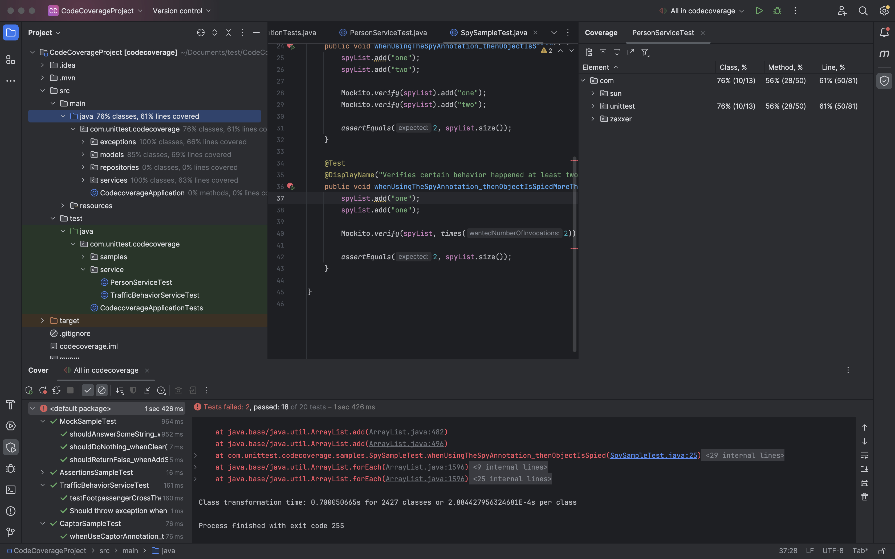
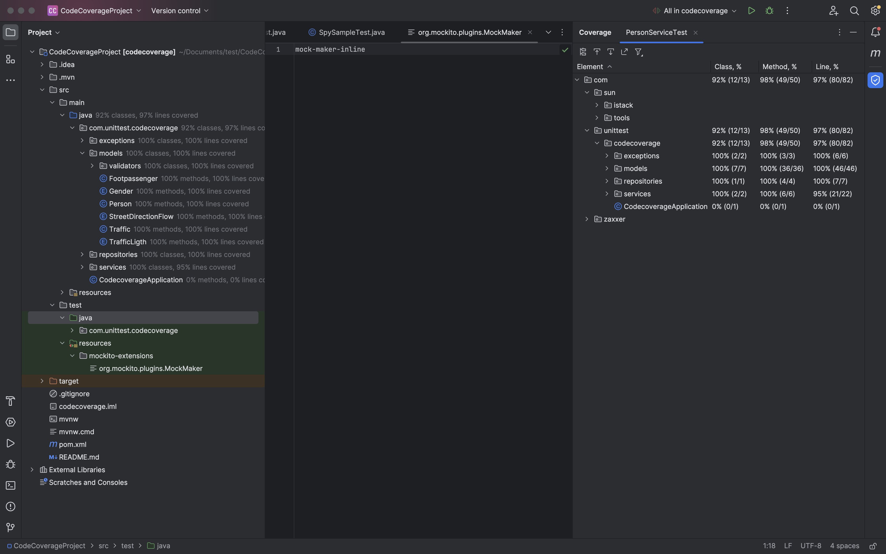

# Test-Coverage

## پروژه اول JSON

طبق دستور آزمایش پیش رفته و درصد پوشش را محاسبه می‌کنیم. سپس ریپورت HTML را ساخته و می‌توان خطوط پوشش‌داده‌شده را مشاهده کرد.

حال مقدار Coverage را برای پروژه بعدی نیز حساب می‌کنیم:

مشاهده می‌شود که پوشش خوبی وجود ندارد و بعضی کلاس‌ها و توابع تست نشده‌اند. حال به کلاس‌های PersonServiceTest و TrafficBehaviourServiceTest یک سری تست جدید اضافه می‌کنیم.

در رابطه با پکیج‌های models و repositoriesاصلا تستی وجود ندارد، پس از ابتدا برای آن‌ها تست می‌نویسیم. در انتها مجددا Run with Coverage را اجرا کرده و افزایش قابل توجهی در پوشش‌دهی مشاهده می‌شود.

