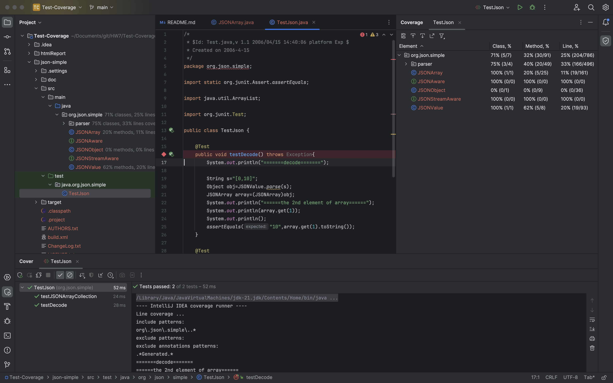
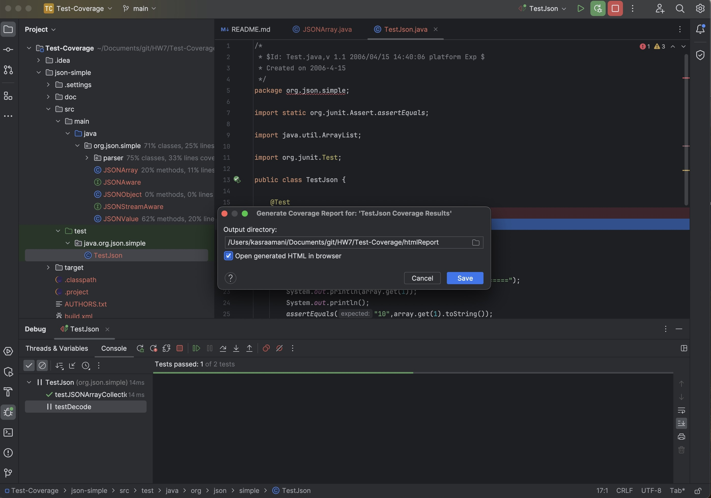
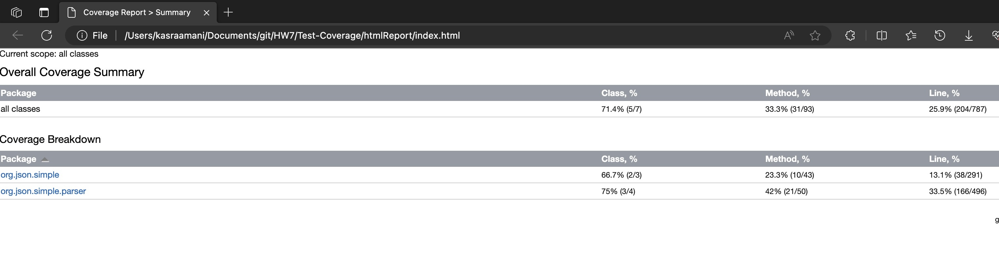
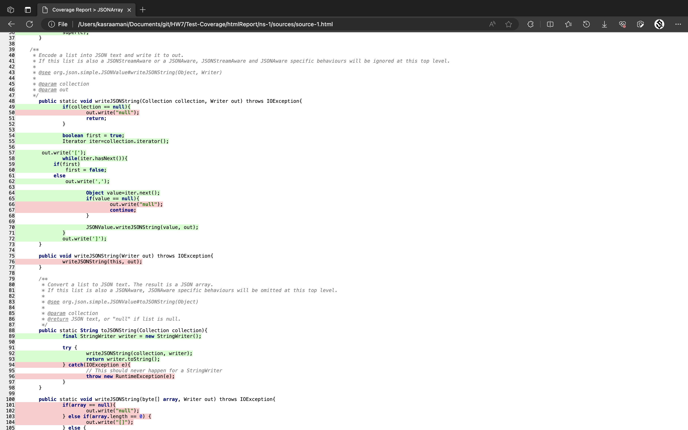

# Test-Coverage

## پروژه اول JSON

طبق دستور آزمایش پیش رفته و درصد پوشش را محاسبه می‌کنیم. سپس ریپورت HTML را ساخته و می‌توان خطوط پوشش‌داده‌شده را مشاهده کرد.

حال مقدار Coverage را برای پروژه بعدی نیز حساب می‌کنیم:

